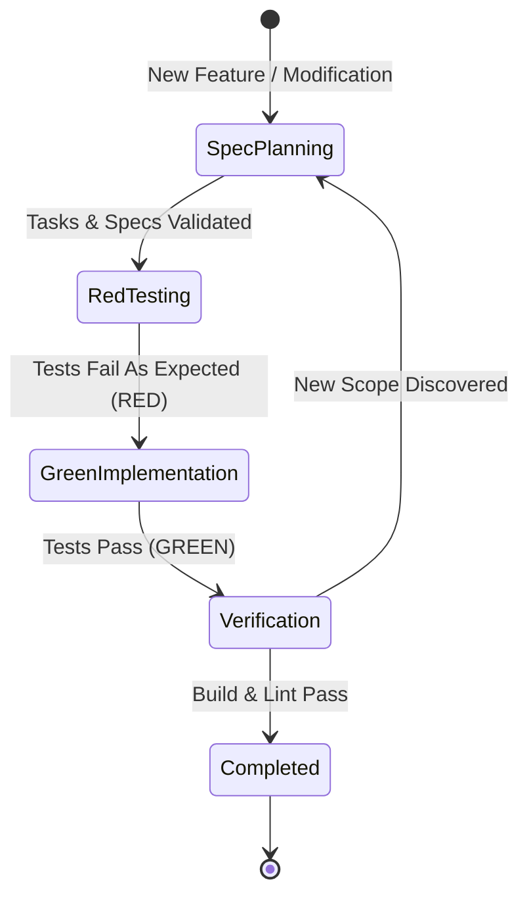

# AI Agent Governance: Graph & Loop Engineering Specification

This document formalizes the AI agent execution policies for the `png-to-mcpack` repository. It provides deterministic constraints for autonomous harnesses (e.g. Antigravity, Claude Code, Cursor, Copilot, Cline, Devin).

---

## 1. State Graph Engineering

Every autonomous task or feature implementation must proceed through a finite state machine:



### State Transition Invariants

| State | Prerequisites | Exit Condition | Invariants |
| :--- | :--- | :--- | :--- |
| **SpecPlanning** | User request / feature need | Planning artifacts validated by `openspec validate` | No application code may be modified during this state |
| **RedTesting** | Plan complete, task selected | Test suite authored and verified failing | Tests must fail due to missing implementation, not syntax errors |
| **GreenImplementation** | Verified failing test | Test suite passes | Implement only the minimal code necessary to satisfy tests |
| **Verification** | All package tests pass | Full suite `go test ./...` and `go build ./...` succeed | Zero regressions across existing capabilities |
| **Completed** | Clean git status | Git commit created following Conventional Commits | All tasks marked `[x]` |

---

## 2. Loop Engineering Guardrails

Unbounded loops waste tokens and risk code degradation. Agents must enforce these mechanical bounds:

### 2.1 Iteration Cap
- **Rule**: A maximum of **3 attempts** (`max_attempts = 3`) is permitted for any single test-repair or debugging loop.
- **Action on Breach**: If a test or build does not succeed after 3 iterations, the agent **must halt immediately**, preserve current diagnostic logs, and report the blocker to the user.

### 2.2 Halting Heuristics
- **Identical Failure Rule**: If an identical error output (same panic, assertion failure, or compiler error) occurs across 2 consecutive iterations without modification effect, halt immediately. Do not attempt a 3rd identical attempt.
- **Scope Creep Rule**: If fixing a test requires altering unrelated packages or expanding the API boundary beyond the active spec, halt and request a spec update.

### 2.3 Idempotency
- All commands, scripts, and build targets must be idempotent.
- Running `go build` or test commands multiple times must produce predictable, deterministic side-effects.

---

## 3. Token & Resource Optimization

To minimize token consumption and maximize response efficiency:

1. **Targeted Test Execution**:
   - During active development, run only the unit test under active development:
     ```bash
     go test -v -run TestSpecificFunction ./internal/pkg/...
     ```
   - Only execute `go test ./...` during the final Verification state.
2. **Context Bounds**:
   - Never print or read raw image files or binary files into conversational context.
   - Restrict log outputs to relevant stack traces or failure messages.
3. **Structured Communication**:
   - Omit discursive pleasantries; report task status, diff summaries, and verification commands directly.

---

## 4. Autonomy & Permission Matrix

| Command / Operation | Autonomy Tier | Policy |
| :--- | :--- | :--- |
| `cat`, `head`, `view_file` | **Tier 1 (Autonomous)** | Allowed without confirmation |
| `go test`, `go build`, `go vet` | **Tier 1 (Autonomous)** | Allowed without confirmation |
| `git status`, `git diff`, `git add` | **Tier 1 (Autonomous)** | Allowed without confirmation |
| `git commit` (Conventional Commits) | **Tier 1 (Autonomous)** | Allowed when tests pass |
| Editing project Go and Markdown files | **Tier 1 (Autonomous)** | Allowed within scope of active task |
| Deleting build artifacts (`/bin/`, `*.mcpack`) | **Tier 2 (Inform User)** | Execute and log action |
| `rm -rf` outside build artifacts | **Tier 3 (User Confirmation Required)** | Prohibited without explicit confirmation |
| Modifying files outside repo boundary | **Tier 3 (User Confirmation Required)** | Strictly prohibited |
| `git push --force` | **Tier 3 (User Confirmation Required)** | Strictly prohibited |
