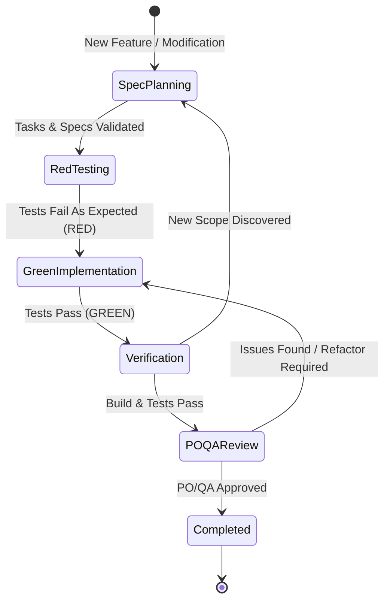

# AI Agent Governance: Graph & Loop Engineering Specification

This document formalizes the AI agent execution policies for the `mcskin` repository. It provides deterministic constraints for supported terminal harnesses: Antigravity and Claude Code.

---

## 1. State Graph Engineering

Every autonomous task or feature implementation must proceed through a finite state machine:



### State Transition Invariants

| State | Prerequisites | Exit Condition | Invariants |
| :--- | :--- | :--- | :--- |
| **SpecPlanning** | Trigger `/opsx-propose`, branch `feat/<nome_spec>` created | Planning artifacts validated by `openspec validate` | **First Command Invariant**: The very first action upon `/opsx-propose` MUST be `git checkout -b feat/<nome_spec>` for rollback isolation. No direct edits on `main`. |
| **RedTesting** | Plan complete, task selected | Test suite authored and verified failing | Tests must fail due to missing implementation, not syntax errors. All unit tests must be 100% mocked with zero integration |
| **GreenImplementation** | Verified failing test | Test suite passes | Implement only the minimal code necessary to satisfy tests |
| **Verification** | All tasks in `/openspec-apply-change` complete | Full suite `go test ./...` and `go build ./...` succeed | **Automatic Trigger**: Automatically transitions to `POQAReview` immediately upon completing implementation tasks |
| **POQAReview** | Build and unit tests succeed | Skill `feature-qa-reviewer` produces formal `APROVADO` report | Simulates PO (user requirements, usability 6+, theme, UX) and QA (binary checks, edge cases, Bedrock compliance). If issues found, transitions to bounded remediation loop |
| **Completed** | PO/QA Approved, clean git status, spec archived via `/opsx-archive` | User confirmation requested for squash merge or GitHub PR | Prompt user to choose between `git checkout main && git merge --squash feat/<nome_spec>` or GitHub Pull Request (`git push origin feat/<nome_spec> && gh pr create ...`). All tasks marked `[x]` |

---

## 2. Loop Engineering Guardrails

Unbounded loops waste tokens and risk code degradation. Agents must enforce these mechanical bounds:

### 2.1 Iteration Cap
- **Rule**: A maximum of **3 attempts** (`max_attempts = 3`) is permitted for any single test-repair, QA-remediation, or debugging loop.
- **Action on Breach**: If a test, build, or QA review does not succeed after 3 iterations, the agent **must halt immediately**, preserve current diagnostic logs, and report the blocker to the user.

### 2.2 Halting Heuristics & Infinite Loop Prevention
- **Identical Failure Rule (2-Strike Halting)**: If an identical error output (same panic, assertion failure, compiler error, or QA rejection reason) occurs across 2 consecutive iterations without modification effect, halt immediately. Do not attempt a 3rd identical attempt.
- **Scope Boundary Rule**: If fixing an issue requires altering unrelated packages or expanding requirements beyond the active specification, halt immediately and request a specification revision (`/openspec-update-change`).
- **Regression Verification Rule**: Always re-execute unit tests (`go test ./...`) prior to re-evaluating with QA to verify fixes didn't introduce collateral regressions.

### 2.3 Idempotency
- All commands, scripts, and build targets must be idempotent.
- Running `go build` or test commands multiple times must produce predictable, deterministic side-effects.

---

## 3. Token & Resource Optimization

To minimize token consumption and maximize response efficiency:

1. **Targeted Test Execution**:
   - During active development, run only the unit test under active development:
     ```bash
     go test -v -run TestSpecificFunction ./internal/pkg/...
     ```
   - Only execute `go test ./...` during the final Verification state.
2. **Context Bounds**:
   - Never print or read raw image files or binary files into conversational context.
   - Restrict log outputs to relevant stack traces or failure messages.
3. **Structured Communication**:
   - Omit discursive pleasantries; report task status, diff summaries, and verification commands directly.
4. **Proactive Skill Suggestion & Autonomy Provisioning**:
   - Whenever an agent detects a repetitive, multi-step, or verbose workflow where creating a specialized SKILL (`.agents/skills/<name>/SKILL.md`) would reduce context window load via progressive disclosure, the agent MUST:
     - Proactively present the proposal to the user with the token conservation rationale and skill design.
     - **Explicitly specify all required authorizations**: List exact shell commands, scripts, and file scopes needed for the skill to run autonomously without repeated user prompts.
     - Await explicit user approval before creating the skill.
   - **Post-Approval Action**:
     - Implement the skill and its support scripts.
     - Immediately update `.agents/scripts/command-gate.py`, `GEMINI.md`, `AGENTS.md`, and this governance document to add the authorized commands to Tier 1 (Auto-Allowed), ensuring frictionless autonomous execution without repetitive permission requests.

---

## 4. Autonomy & Permission Matrix

Commands are categorized into 3 permission tiers, enforced both via prompt rules and mechanically via `.agents/hooks.json`:

| Category | Allowed Commands | Autonomy Tier | Enforcement |
| :--- | :--- | :--- | :--- |
| **Go Toolchain** | `go test ...`, `go build ...`, `go vet ...`, `go run ...`, `go fmt ...`, `go mod tidy`, `go mod verify`, `go version`, `go doc` | **Tier 1 (Auto-Allowed)** | Allowed autonomously |
| **Build & Test** | `make`, `make test`, `make build`, `make build-linux`, `make build-windows`, `make lint`, `make clean` | **Tier 1 (Auto-Allowed)** | Allowed autonomously |
| **Local Binary** | `./bin/mcskin ...`, `./bin/png-to-mcpack ...` | **Tier 1 (Auto-Allowed)** | Allowed autonomously |
| **OpenSpec** | `openspec ...` | **Tier 1 (Auto-Allowed)** | Allowed autonomously |
| **Safe Git & GitHub** | `git status`, `git diff`, `git log`, `git show`, `git branch`, `git add`, `git commit`, `git checkout -b feat/...`, `git checkout main`, `git merge --squash ...`, `git push origin feat/...`, `gh pr create ...`, `gh pr view ...`, `gh pr status` | **Tier 1 (Auto-Allowed)** | Allowed autonomously |
| **Inspection** | `ls`, `cat`, `head`, `tail`, `grep`, `find`, `which`, `stat`, `file`, `unzip -l`, `unzip -p` | **Tier 1 (Auto-Allowed)** | Allowed autonomously |
| **Artifact Cleanup**| `rm -rf bin/`, `rm -rf files/*.mcpack` | **Tier 1 (Auto-Allowed)** | Allowed autonomously |
| **Unrecognized** | External network tools, arbitrary scripts | **Tier 2 (Ask User)** | Requires user approval |
| **Dangerous Deletion** | `rm -rf /`, `rm -rf *`, `rm -rf .`, `rm -rf ..`, `rm -rf .git`, `rm -rf ~` | **Tier 3 (BLOCKED)** | Denied by security policy |
| **Destructive Git** | `git push --force`, `git push -f`, `git reset --hard`, `git clean -f`, `git branch -D` | **Tier 3 (BLOCKED)** | Denied by security policy |
| **System Modification** | `sudo`, `su`, `mkfs`, `dd if=`, `chmod -R 777`, `shutdown`, `reboot` | **Tier 3 (BLOCKED)** | Denied by security policy |
| **Filesystem Escape** | Any modification or deletion outside `/home/douglas/Workspace/minecraft/png-to-mcpack` | **Tier 3 (BLOCKED)** | Denied by security policy |

### 4.1 Mechanical Enforcement via `hooks.json`

Antigravity executes `.agents/scripts/command-gate.py` on the `PreToolUse` event for `run_command`:
- Returns `"decision": "allow"` for Tier 1 harmless commands.
- Returns `"decision": "deny"` with an actionable explanation for Tier 3 destructive commands.
- Returns `"decision": "ask"` for Tier 2 commands to ensure user visibility.

---

## 5. Host & Environment Security Protocol

To protect the host operating system and execution environment:

### 5.1 Workspace Boundary Isolation
- AI harnesses must operate strictly inside `/home/douglas/Workspace/minecraft/png-to-mcpack`.
- Access, modification, or deletion of files outside this root (e.g. `~/.ssh`, `~/.bashrc`, `~/.config`, `/etc`, `/usr`) is strictly forbidden and blocked.

### 5.2 Zero Privilege Escalation
- Harnesses run under standard non-privileged user permissions. Commands requiring `sudo`, `su`, or modifying file ownership (`chown`, `chmod 777`) are hard-blocked.

### 5.3 Process Safety & Air-Gapped Execution
- All build and test runs must be air-gapped (no external network or socket connections).
- Commands execute synchronously with strict timeouts (max 30s) to prevent orphan processes, hangs, or fork bombs.
- No background daemonizing, shell hooking, crontab manipulation, or persistence mechanisms.

### 5.4 Strict Unit Test Mocking Standards
- Unit tests must be 100% isolated and pure: all I/O must be mocked using in-memory abstractions (`io.Reader`, `bytes.Buffer`, mock structs).
- No unit test may perform persistent filesystem writes (outside ephemeral `t.TempDir()`), network I/O, or OS process execution.
- Integration tests that verify real packaging pipelines must be explicitly segregated from unit tests.


