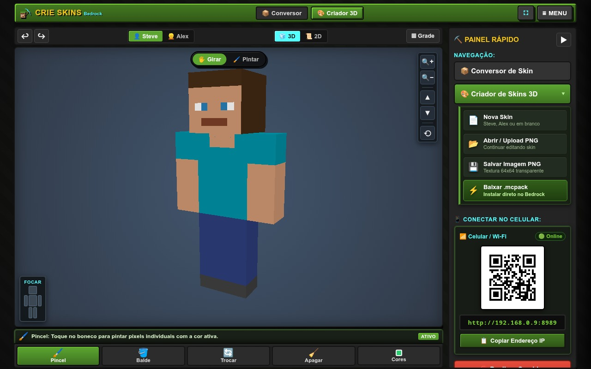
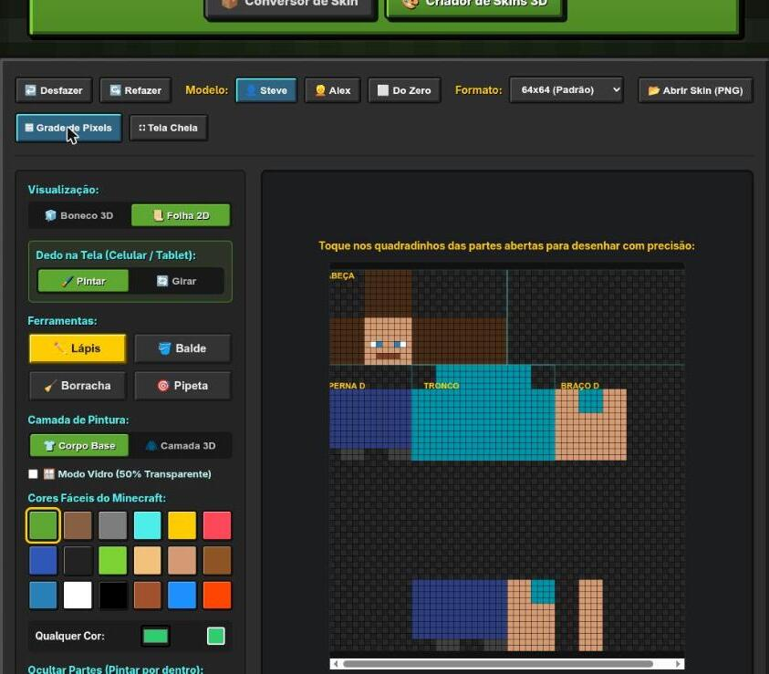
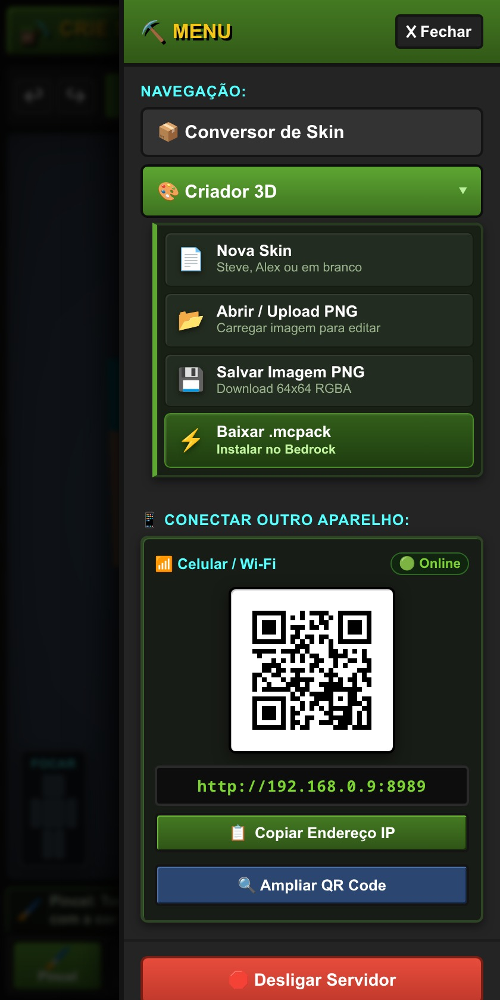
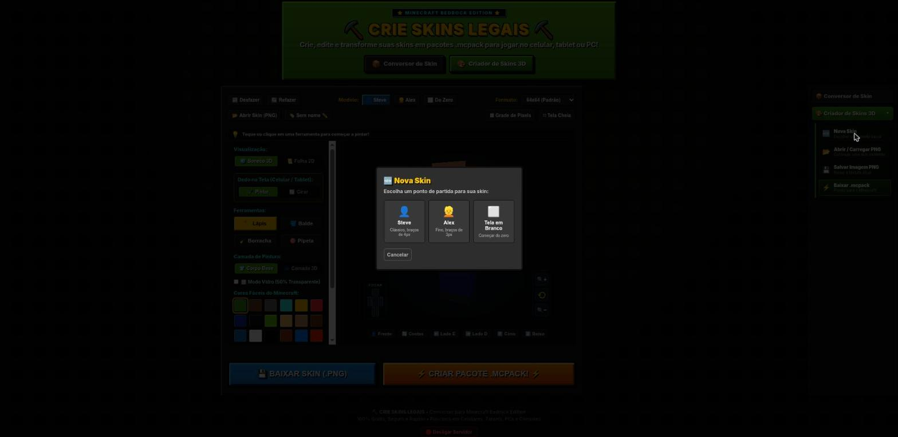
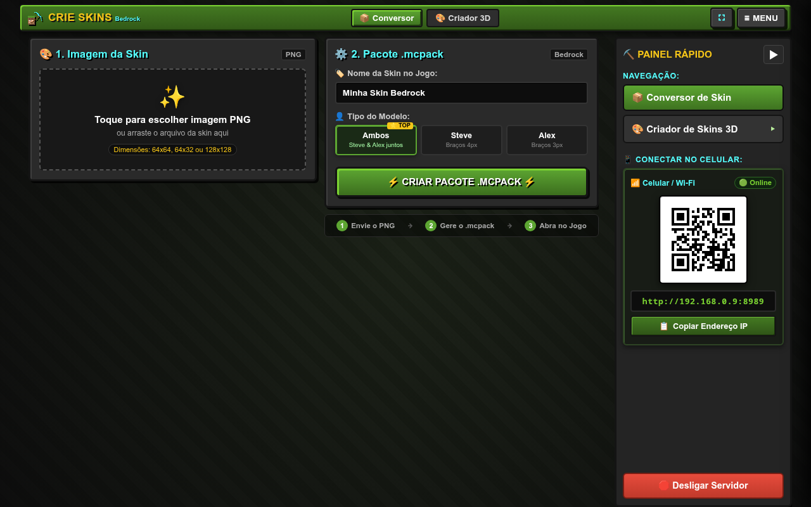

# mcskin

<p align="center">
  <b>Português (Brasil)</b> • <a href="README.en.md">English</a> • <a href="README.es.md">Español</a>
</p>

> **Crie e instale skins do Minecraft Bedrock direto no navegador — sem propaganda, sem cadastro, 100% seguro para crianças.** Um editor 3D/2D e conversor que roda no computador de casa e conecta com celulares e tablets da mesma rede Wi-Fi via QR Code.

[]()
[]()
[]()
[]()
[](https://golang.org)
[]()
[]()
[](LICENSE)

---

## 💡 Por que o `mcskin` foi criado?

A maioria dos sites de skins na internet é uma armadilha para uma criança de 6 anos que só quer personalizar seu personagem: anúncios piscando por toda parte, botões falsos de download que tentam instalar vírus, exigência de cadastros com e-mail e interfaces difíceis de usar em telas de toque.

O **`mcskin`** foi criado para devolver a tranquilidade aos pais e a alegria da criação às crianças:

| O que acontece em sites da internet? | Como é no `mcskin`? |
| :--- | :--- |
| ❌ **Anúncios invasivos**, banners piscando e vídeos pop-up | ✅ **Zero anúncios**: tela limpa, silenciosa e 100% focada na criatividade |
| ❌ **Botões falsos de "Download"** que levam a vírus e malwares | ✅ **1 clique seguro**: gera apenas o pacote `.mcpack` oficial direto da sua máquina |
| ❌ **Exigência de cadastro**, login, e-mail ou dados pessoais | ✅ **Sem contas nem senhas**: anonimato total e privacidade de dados da família |
| ❌ **Botões minúsculos** e menus difíceis para dedos pequenos | ✅ **Feito para crianças (6+)**: botões grandes (64px+) e atalhos táteis acolhedores |
| ❌ **Transferência complicada** por cabos, pen drives ou e-mails | ✅ **Conexão instantânea via QR Code**: celular/tablet acessa pela rede Wi-Fi local |
| ❌ **Skins incompatíveis** com braços quebrados no jogo | ✅ **Bedrock Oficial Dual-Model**: gera automaticamente variantes Steve (4px) e Alex (3px) |

---

## 🚀 Como Começar em 3 Passos

Não precisa instalar aplicativos nas lojas (App Store ou Google Play), nem configurar servidores complexos. Basta seguir estes 3 passos simples:

```
 [1. Iniciar no PC]  ───────>  [2. Conectar Tablet/Celular]  ───────>  [3. Pintar e Jogar!]
 Duplo clique no executável       Aponte a câmera pro QR Code             Crie a skin e abra no
 (abre o navegador local)         (abre direto no navegador)              Minecraft com 1 toque
```

### 1️⃣ Iniciar no Computador
- **No Windows**: Dê um duplo clique no arquivo `mcskin.exe`. O navegador abrirá automaticamente na tela *"CRIE SKINS LEGAIS"*.
- **No Linux / macOS**: Execute no terminal:
  ```bash
  ./bin/mcskin --web
  ```

### 2️⃣ Conectar o Tablet ou Celular (Opcional)
- Aponte a câmera do celular ou tablet para o **QR Code** exibido na tela do computador.
- O editor abrirá instantaneamente no navegador do aparelho, conectado através da sua rede Wi-Fi de casa. Sem cabos, sem Bluetooth e sem instalar nada!

### 3️⃣ Pintar e Jogar!
- Escolha uma cor na paleta e pinte livremente no modelo 3D ou na folha 2D.
- Ao terminar, clique em **"Baixar Pacote Bedrock (.mcpack)"** e toque em **"Abrir com o Minecraft"**. Sua skin já estará pronta no Vestiário do jogo!

---

## 🎨 Vitrine da Interface Web — "CRIE SKINS LEGAIS"

O editor foi desenvolvido com foco total em ergonomia infantil, garantindo que mesmo crianças pequenas possam explorar sua imaginação sem frustrações.

<p align="center">
  <br>
  <sub><b>Editor 3D Imersivo</b>: tudo cabe na tela sem rolagem vertical, com dock inferior de fácil alcance, cores vivas, QR Code de conexão e controles de visualização simplificados.</sub>
</p>

<p align="center">
  
  &nbsp;&nbsp;&nbsp;&nbsp;
  
</p>
<p align="center"><sub><b>Esquerda</b>: modo 2D desdobrado com grade de precisão para alcançar partes escondidas. <b>Direita</b>: navegação móvel em gaveta deslizante no celular/tablet.</sub></p>

<p align="center">
  <br>
  <sub><b>Modal Nova Skin</b>: ponto de partida intuitivo para Steve Clássico (4px), Alex Slim (3px) ou Skin em Branco.</sub>
</p>

### Destaques Pensados para os Pequenos:

- 🧒 **Botões Grandes (64px+) & Área de Toque Generosa**: Nada de botões minúsculos que causam cliques acidentais. Todas as ferramentas e paletas foram desenhadas para telas sensíveis ao toque.
- 🔄/🖌️ **Alternador "Pintar" vs. "Girar"**: Uma trava inteligente que evita estragar o desenho ao tentar girar o boneco, ou girar a câmera sem querer quando a criança só queria pintar um detalhe.
- 📐 **Layout Imersivo 100dvh (Zero Rolagem)**: A interface inteira se ajusta perfeitamente à tela do aparelho, eliminando barras de rolagem que atrapalham a navegação dos pequenos.
- 🧊/📜 **Alternador 3D & 2D Integrado**: Alterne com 1 toque entre o boneco tridimensional interativo e a folha de textura aberta (2D) para alcançar dobraduras e partes escondidas com máxima precisão.
- 🤖 **Importação Inteligente de Skins geradas por IA**: Carregue imagens criadas no ChatGPT, Midjourney, DALL-E ou Bing em qualquer resolução — o sistema redimensiona e preserva a nitidez pixel a pixel automaticamente.
- 🪄 **Detecção & Remoção de Fundo em 1 Toque**: Identifica se a imagem veio com fundo sólido e oferece a remoção automática sem complicar a vida dos pais.
- 🔲 **Grade de Precisão Sutil**: Linhas de referência ultrafinas em 16x com sombra suave para enxergar cada pixel sem poluir o visual da skin.
- 🔊 **Efeitos Sonoros Lúdicos**: Sons autênticos de "level up" celebram o momento em que a criança conclui e salva sua criação.

---

### 📦 Conversor Rápido (para quem já tem uma imagem PNG)

Se a criança já tiver uma imagem de skin pronta no computador ou gerada por inteligência artificial, não é necessário desenhar do zero:

<p align="center">
  <br>
  <sub><b>Conversor Rápido</b>: arraste o arquivo PNG ou imagem de IA, defina o nome do pacote e escaneie o QR Code no tablet para instalar no Minecraft Bedrock.</sub>
</p>

---

## 🎮 Como Equipar a Skin no Minecraft Bedrock

Após baixar o arquivo `.mcpack`, veja como é fácil colocá-lo no jogo:

### No Windows 10 / 11:
1. Dê um **duplo clique** no arquivo `.mcpack` baixado.
2. O Minecraft iniciará automaticamente exibindo a notificação: `Importação iniciada...` seguida por `Importação de pacote de capa bem-sucedida`.

### No Celular ou Tablet (Android / iOS / iPadOS):
1. Baixe o arquivo `.mcpack` pelo navegador do aparelho.
2. Toque na notificação de download concluído e selecione **"Abrir com o Minecraft"** (ou localize o arquivo no app *Arquivos* / *Downloads* do aparelho).

### Dentro do Jogo (Vestiário):
1. Na tela principal do Minecraft, clique em **Vestiário** (ou *Dressing Room*).
2. Toque no ícone de cabide (**Capas Clássicas**).
3. Localize o pacote com o nome da sua skin.
4. Por padrão, o `mcskin` cria os dois modelos oficiais:
   - **`<Nome> (Classic)`**: braços normais de 4 pixels (Steve).
   - **`<Nome> (Slim)`**: braços finos de 3 pixels (Alex).
5. Escolha a sua preferida e toque em **Equipar**!

---

## 💻 Uso via Linha de Comando (CLI)

Para usuários avançados, administradores de servidores ou desenvolvedores, o `mcskin` também oferece um modo CLI completo, rápido e sem dependências:

```bash
mcskin [opções] <caminho/para/skin.png>
```

### Tabela Completa de Opções

| Opção | Descrição |
| :--- | :--- |
| *(sem flag)* | **Padrão:** Gera ambos os modelos (Clássico 4px e Slim 3px) no mesmo pacote `.mcpack`. |
| `--both` | Força explicitamente a inclusão dos dois modelos (Clássico e Slim). |
| `--classic` | Restringe a geração apenas ao modelo clássico (braços de 4px / Steve). |
| `--slim` | Restringe a geração apenas ao modelo fino (braços de 3px / Alex). |
| `--force` | Sobrescreve o arquivo `.mcpack` de saída se ele já existir (padrão: `true`). |
| `-i`, `--input` | Informa o caminho do arquivo PNG de entrada via parâmetro nomeado. |
| `-w`, `--web` | Inicia o servidor web local com o Conversor e o Editor 3D/2D. |
| `-p`, `--port` | Define a porta do servidor web (padrão: `8080`). Usado apenas com `--web`. |
| `--no-browser` | No modo web, não abre o navegador padrão automaticamente. |
| `-v`, `--version` | Exibe a versão, commit e data de compilação do executável. |
| `-h`, `--help` | Exibe a mensagem de ajuda com todos os parâmetros disponíveis. |

> *Nota: As opções `--classic` e `--slim` são mutuamente exclusivas.*

### Exemplos de Linha de Comando

```bash
# Conversão padrão gerando ambos os modelos (Steve e Alex):
./bin/mcskin minhas_skins/guerreiro.png
# -> Gera: minhas_skins/guerreiro.mcpack

# Restringir apenas ao modelo clássico (Steve, 4px):
./bin/mcskin --classic minhas_skins/steve_custom.png

# Restringir apenas ao modelo slim (Alex, 3px):
./bin/mcskin --slim minhas_skins/alex_custom.png

# Iniciar servidor web em porta customizada sem abrir navegador:
./bin/mcskin --web --port 9090 --no-browser
```

---

## 📦 Estrutura Técnica do Pacote `.mcpack`

O arquivo `.mcpack` gerado é um arquivo ZIP padronizado em conformidade com as diretrizes oficiais do Minecraft Bedrock:

```text
[nome_da_skin].mcpack
├── manifest.json       # Manifesto com UUIDs v4 (RFC-4122) únicos para o pacote
├── skins.json          # Registro das skins e mapeamento de geometria (classic e slim)
├── texts/
│   └── en_US.lang      # Chaves de localização para exibição dos nomes no jogo
└── [nome_da_skin].png  # Imagem da textura compartilhada na raiz do pacote
```

### Requisitos Técnicos da Imagem PNG:
- **Formato**: PNG válido (RGBA).
- **Dimensões aceitas**:
  - `64x64` pixels (padrão moderno do Minecraft).
  - `128x128` pixels (skins em alta resolução HD suportadas pelo Bedrock).
  - `64x32` pixels (formato clássico legado pré-1.8).

---

## 📥 Downloads das Releases (CI/CD Oficial)

Os executáveis estáticos oficiais são compilados automaticamente através do GitHub Actions ([`.github/workflows/release.yml`](.github/workflows/release.yml)) a cada nova versão lançada:

- **Windows (`amd64`)**: Arquivo `mcskin_<tag>_windows_amd64.zip` com ícones oficiais e metadados nativos (`mcskin.exe`).
- **Linux (`amd64`)**: Arquivo `mcskin_<tag>_linux_amd64.tar.gz` contendo o binário estático e documentação.
- **Integridade**: Acompanha o arquivo `checksums.txt` com as somas de verificação SHA-256 de todos os binários.

Acesse a página de **[Releases no GitHub](https://github.com/douglaspands/mcskin/releases)** para baixar a versão mais recente.

---

## 🛠️ Guia para Desenvolvedores

Esta seção é destinada a quem deseja compilar o projeto do código-fonte, executar a suíte de testes ou contribuir com o repositório.

### Pré-requisitos
- [Go](https://go.dev/dl/) versão 1.25 ou superior.
- Git.
- `make` (opcional, para uso dos comandos automatizados).

### Compilação com Makefile

```bash
# Compila os binários para Linux e Windows na pasta bin/ com injeção de versão:
make build

# Compila apenas para Linux (amd64):
make build-linux

# Compila apenas para Windows (.exe com manifesto de confiança embutido):
make build-windows

# Executa todos os testes unitários:
make test

# Executa o linter oficial (go vet):
make lint

# Limpa artefatos compilados e arquivos temporários:
make clean
```

### Test-Driven Development (TDD) & Isolamento em Memória
O projeto segue o padrão rigoroso de **TDD** e **100% de isolamento em testes unitários**:

```bash
# Executa a suíte de testes compacta (silenciosa em caso de sucesso):
./scripts/test-compact.sh

# Executa testes unitários por pacote:
go test -v ./internal/bedrock/...
go test -v ./internal/converter/...
go test -v ./internal/skin/...
go test -v ./internal/pack/...
go test -v ./cmd/mcskin/...
```

> **Regra de Isolamento**: Testes unitários são 100% mockados em memória (`bytes.Buffer`, `bytes.Reader`). Nenhum teste unitário faz requisições externas de rede nem grava em disco fora de pastas temporárias transitórias (`t.TempDir()`).

### Verificação do `.mcpack` com a Skill do Projeto
Para inspecionar e validar esquemas JSON, UUIDs v4 e conformidade de texturas de qualquer pacote gerado:

```bash
python3 .agents/skills/bedrock-skin-pack-verifier/scripts/verify-mcpack.py caminho/para/skin.mcpack
```

---

## 📄 Licença

Este projeto está licenciado sob os termos da licença [MIT](LICENSE). É livre e gratuito para uso pessoal, educacional e comercial.
